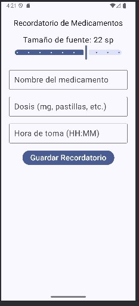

Integrantes:
-Hanccocallo Achircana, Frank Duks
-Chancuaña Alvis, Klisman

Aplicacion movil para adultos mayores

Descripcion:

El proyecto consiste en una aplicación móvil diseñada para ayudar a los adultos mayores a recordar la toma de sus medicamentos de manera sencilla y accesible. A través de una interfaz amigable, el usuario puede registrar recordatorios y ajustar el tamaño de la fuente según su preferencia visual mediante un control deslizante. Además, la aplicación guarda automáticamente la configuración del tamaño de texto utilizando DataStore, garantizando que los cambios se mantengan incluso al cerrar y volver a abrir la app.

---

Eleccion de Bibliotecas:

Uso de DataStore (en lugar de SharedPreferences)

Optamos por DataStore porque es la herramienta más moderna y segura para guardar configuraciones o preferencias del usuario, reemplazando al antiguo SharedPreferences. La gran ventaja es que usa flujos de datos (Flow), lo que significa que los cambios se pueden observar en tiempo real, sin necesidad de recargar la app. Además, DataStore guarda los datos de forma asíncrona y segura frente a errores de concurrencia, algo esencial si la app crece. Y es una opcion mederna a SharedPreferences.

Uso de remember y mutableStateOf

Estas funciones forman parte del manejo de estado en Compose. Básicamente, sirven para que la interfaz recuerde y reactive los valores que cambian durante la interacción del usuario. Por ejemplo, cuando el adulto mayor mueve el control de tamaño de fuente, el valor se guarda en una variable con mutableStateOf, y como Compose es reactivo, la vista del texto se actualiza automáticamente al nuevo tamaño.
